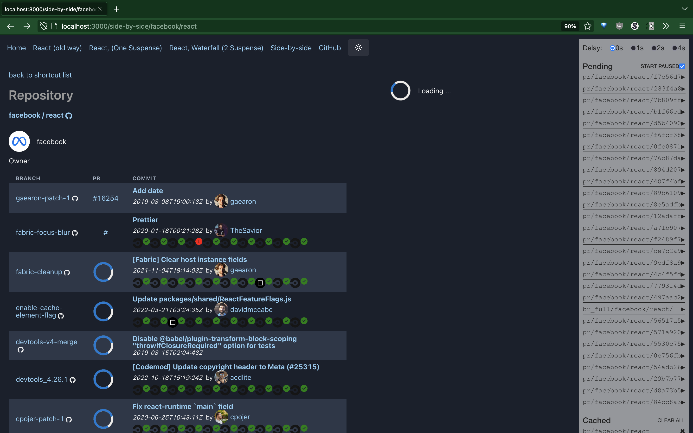

## Stack

-   Next.js
-   ChakraUI
-   React
-   React.Cache
-   React.Suspend
-   Typescript

## Purpose

List the `(feature) branches` of a GitHub repository with its

-   last commit's build status
-   last commit's linked PR
-   last commit's commit message

Side by side comparison and playground showing loading indicators [hitchcock](https://github.com/pomber/hitchcock#readme) by [@pombo](https://github.com/pomber), based on work of Jared Palmer

## Getting started

After invoking this in a shell

    git clone https://github.com/lowsky/react-suspense-meetup-demo
    cd react-suspense-meetup-demo

    # Install the dependencies of the react app and
    # installs the server's dependencies, too:
    yarn

then set up the `github-token` (see [Setup GitHub Token](#setupgithubtoken) ) before starting local dev mode via:

    yarn dev

This runs Next.js dev-mode which includes the endpoints for the graphql API.

Open the home [http://localhost:3000](http://localhost:3000) with your browser.

Have fun!

### setupGithubToken

You **need to create your own github-token** (see https://github.com/settings/tokens/) and
store it locally in `.env` file

    # create an .env file with this content ...

GITHUB_TOKEN=XXX

    # ... and replace the XXX with your API key
    # typically something like ghp_....

## ScreenShot

## License

Licensed under the Apache License 2.0, Copyright ©️ 2022 Robert Hostlowsky. See [LICENSE](LICENSE) for more information.
